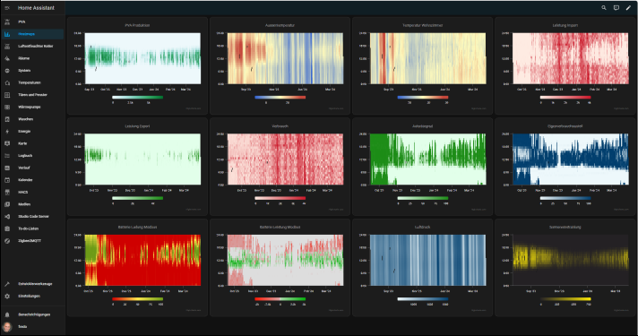
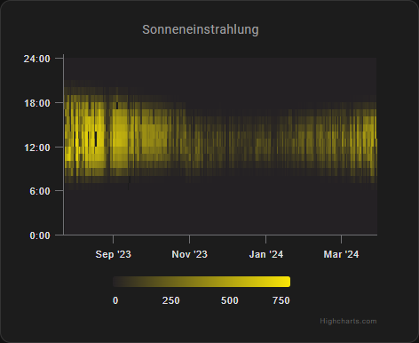
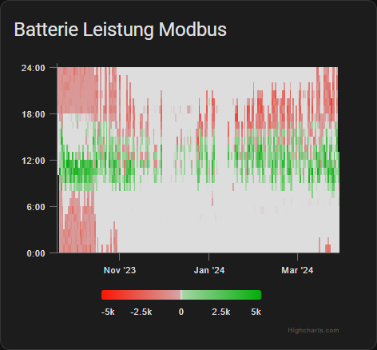
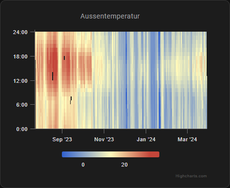

# Highcharts Heatmap card for Home Assistant

Custom card enabling [Heat maps](https://en.wikipedia.org/wiki/Heat_map) in Home Assistant. Makes it simple to visualize the data in your Home Assistant, as a heatmap.

This card was inspired from the [Heatmap card for Home Assistant](https://github.com/kandsten/ha-heatmap-card/tree/main).



## Disclaimer
This software is provided "as is" without any representations or warranties, express or implied. The user of this software assumes all responsibility and risk for the use of this software and any associated services or documentation.

In no event shall the creator of this software be liable for any damages whatsoever (including, without limitation, damages for loss of data or profit, or due to business interruption) arising out of the use or inability to use this software, even if the creator of this software has been advised of the possibility of such damages.

This software utilizes Highcharts software components, but the creator of this software is not affiliated with, sponsored by, or endorsed by Highcharts in any way. Highcharts is a registered trademark of Highsoft AS.

The user acknowledges and agrees that they are responsible for obtaining a valid license for the use of Highcharts software components with this software. The creator of this software shall not be responsible for any failure to obtain or maintain such licenses.

The user acknowledges and agrees that they have reviewed and accepted the terms of this disclaimer before using this software.

## Highcharts license
This is a forum entry on the question of whether my code may be shared publicly: [Personal license question](https://www.highcharts.com/forum/viewtopic.php?p=192077)

Important quote from the answer:
> With that, you can publicly share your code, but please keep in mind that with a Personal License it is a requirement that:
> - the Highcharts watermark is retained
> - communicating that a license is required in order to use Highcharts
>
> [...]
>
> **Important Notice**: This information is accurate as of now, but it could change in the future. Ensure you keep yourself updated with the latest licensing policies available on the Highcharts website.
>
> [...]


[Personal License](https://shop.highcharts.com/contact/personal)

[Other License](https://shop.highcharts.com/)


## Installation
For now only manual installation is supported.

### Manual install
* Download the Highcharts Library (https://www.highcharts.com/download/)
* Create a new directory `highcharts` in your `config/www` directory.
* Copy the directory `es-modules` found in the downloaded zip file under `code` to the created `highcharts`directory.
* Download `fch-highcharts-heatmap-card.js`, place it in your `config/www` directory.
* Add `local/fch-highcharts-heatmap-card.js` in your Resource config, type of `JavaScript Module`.
   
```
www/
|
|__ highcharts
|   |
|   |__ es-modules
|       |
|       |__ Accessibility
|       |
|       |__ ...
|
|__ fch-highcharts-heatmap-card.js
|
```

## Configuration
### Minimal example
``` YAML
type: custom:fch-highcharts-heatmap-card
entity: sensor.pva_produktion_berechnet
```
It'll pick a card `title` based on the name of the entity and present the default 21 days.

### Configuration variables
| Name     | Required | Description | Default | Range / Sample |
| -------- | -------- | ----------- | ------- | ----- |
| type     | YES      | Type of card |  | `fch-highcharts-heatmap-card`
| entity   | YES      | Entity ID to show | | |
| days     |          | Number of days to show | 21 |  |
| chartHeight |          | High of the chart without/with title | 300 / 352 |  |
| titleInChart | | If the title is in the chart or in the card | `true` | |
| data |  | See next table | | |

#### data
| Name     | Description |
| -------- | -------- |
| min      | Minimum value for scale |
| max      | Maximum value for scale |
| colors   | Color scheme            |
| invert_colors | Invert the color scale |

### Standard colors
*  &rarr; `default`
*  &rarr; `outdoor_temperature` (-30 °C .. 54 °C)
*  &rarr; `indoor_temperature` (-12 °C .. 28 °C)
*  &rarr; `blue_green`
*  &rarr; `blue_purple`
*  &rarr; `red_purple`
*  &rarr; `yellow_brown`
*  &rarr; `iron_red`
*  &rarr; `stop_light`
*  &rarr; `white_hot`
*  &rarr; `black_hot`
*  &rarr; `blue`
*  &rarr; `red`
*  &rarr; `green`
*  &rarr; `co2` (520 .. 3000)
*  &rarr; `pm25` (0 .. 100)

Some colors have a standard range (in parenthesis). But it is always possible to define your own range with min/max.

### Custom colors
You can define an own color range as a list of list. See next section for examples.

### Examples


``` YAML
type: custom:fch-highcharts-heatmap-card
days: 365
entity: sensor.easyweatherv1_6_5_solar_radiation
title: Sonneneinstrahlung
data:
  colors:
    - - 0
      - '#242124'
    - - 1
      - '#fae607'
```




``` YAML
type: custom:fch-highcharts-heatmap-card
days: 365
entity: sensor.batterie_leistung_modbus
titleInChart: false
data:
  colors:
    - - 0
      - '#FA1602'
    - - 0.49
      - '#d6a3a3'
    - - 0.5
      - '#dddddd'
    - - 0.51
      - '#a4d6a3'
    - - 1
      - '#02AD09'
  min: -5000
  max: 5000
```




``` YAML
type: custom:fch-highcharts-heatmap-card
days: 365
entity: sensor.easyweatherv1_6_5_outdoor_temperature
```
